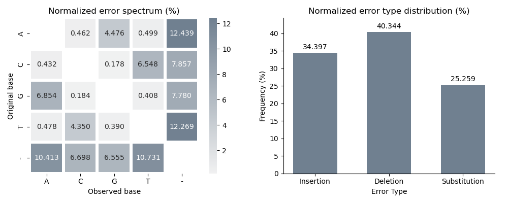
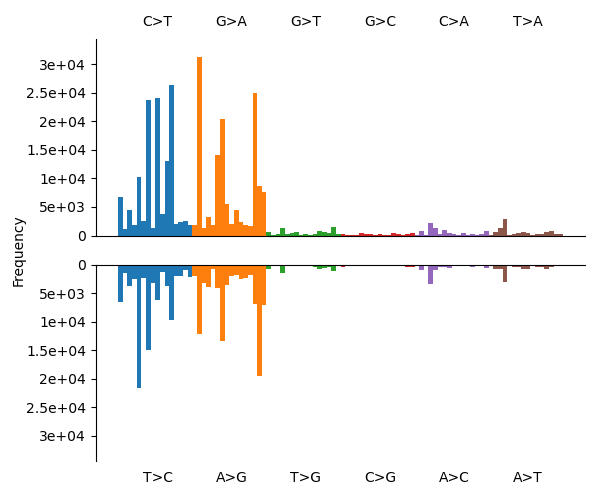
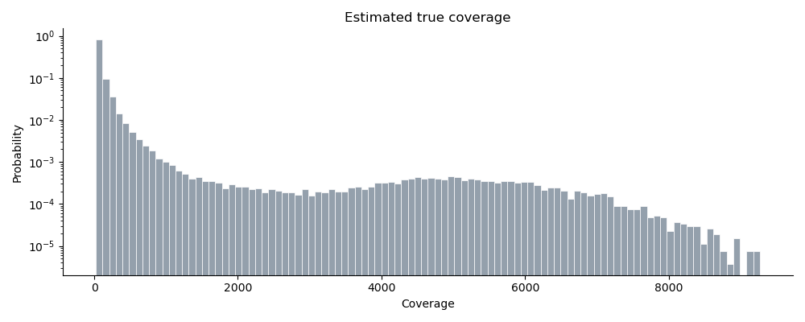

<p align="center">
  
</p>

# Skiver: Alignment-free estimation of sequencing error rates and spectra using $(k,v)$-mer sketches

Skiver is a tool that aims to perform quality control for a set of reads, estimating the sequencing error rates/types, without relying on the quality scores or the need for the correct reference genome. It works the best for metagenomic samples where at least one genome has high coverage (>20 $\times$).

## Installation

### Download executable

Simply download the executable from the latest release, via the following

```bash
wget https://github.com/GZHoffie/skiver/releases/download/v0.0.1/skiver
chmod +x ./skiver
./skiver
```

### Build from source

Alternatively, build skiver from the source code. Install [rust](https://rust-lang.org/tools/install/), and build using

```bash
git clone https://github.com/GZHoffie/skiver.git
cd skiver

# If default rust install directory is ~/.cargo
cargo install --path . --root ~/.cargo
```

## Quick start

Basic commands:

```bash
# sketch the read files + analyze
skiver sketch [sequence_file_1] [sequence_file_2] ... -o sequences.kvmer
skiver analyze sequences.kvmer > report.csv

# Alternatively, analyze the files directly
skiver analyze [sequence_file_1] [sequence_file_2] ... > report.csv

# If a reference genome is provided
skiver analyze [sequence_file_1] [sequence_file_2] ... -r [reference_file] > report.csv
```

The input sequence files can be represented using regex. Gzipped files are also accepted.

For the full set of available options, use the help function,


```bash
skiver sketch -h
skiver analyze -h
```

### Interpreting the results

The output csv has the following format

```
lambda,lambda_5-95th_percentile,beta,beta_5-95th_percentile,key_median_coverage,key_coverage_5-95th_percentile,true_median_coverage,true_coverage_5-95th_percentile,A[C>A]A,A[C>A]C,A[C>A]G...
0.038009,0.035987~0.040569,0.937677,0.922367~0.951638,30.000000,21.000000~39.000000,58.057400,40.640179~75.474617,102,194,110
```

where `lambda` and `beta` are the estimated parameters for the discrete Weibull distribution. The per-base error rate can be calculated by
$$\hat{\varepsilon}=1-\exp(-\hat{\lambda}),$$
and the probability that a $k$-mer in the read is free of sequencing error would be
$$S(k)=\exp(-\hat{\lambda} k^{\hat{\beta}}).$$
Fields such as `A[C>A]A` represents the number of times a type of error happening in the read. For example, `A[C>A]A` represents a substitution in 3-mer `ACA` to `AAA`, `C[G>-]A` represents a deletion of `G` between `C` and `A`. These fields are used to infer sequencing error spectra and bias.

## Visualizing the sequencing biases

We provide scripts in `./scripts` for easy visualization of skiver's output. Below is an example using [Zymo mock community reads from Loman Lab](https://lomanlab.github.io/mockcommunity/).

```bash
# Download the read data
wget ftp://ftp.sra.ebi.ac.uk/vol1/fastq/ERR315/006/ERR3152366/ERR3152366.fastq.gz

# Create the (k,v)-mer sketch of the data
skiver sketch ./ERR3152366.fastq.gz -o ERR3152366.kvmer

# Run skiver analyze, with all the verbose output
skiver analyze ERR3152366.kvmer --hazard-rate hazard_rate.csv -o verbose_output.csv > skiver_report.csv
```

Here, `hazard_rate.csv` contains the estimated hazard rate over a range of `t`, `verbose_output.csv` contains the key and the consensus values of the sketched (k,v)-mers (mainly for debugging), and `skiver_report.csv` contains the estimated error rates/spectra.

- **Visualizing error spectrum**

  ```bash
  python ./scripts/plot_spectrum.py skiver_report.csv ./figures/spectrum.png --normalize
  ```

  will plot the error spectrum in `./figures/spectrum.png`. If `--normalize` is set, the error spectrum is normalized such that the frequencies sum to 1. Otherwise, they sum up to the estimated per-base error rate. The output image looks like this.

  
  <p align="center">
    
  </p>

- **Visualizing single base substitution (SBS) spectrum** (beta)

  ```bash
  python ./scripts/plot_sbs96_spectrum.py skiver_report.csv ./figures/sbs_spectrum.png
  ```

  will plot the [SBS96](https://cancer.sanger.ac.uk/signatures/sbs/sbs96/) spectrum.

  <p align="center">
    
  </p>

- **Visualizing coverage** (beta)

  ```bash
  python ./scripts/plot_coverage.py verbose_output.csv skiver_report.csv ./figures/coverage.png
  ```

  will plot the estimated **true** coverage of the analyzed file. The true coverage is estimated by the multiplicities of the key from the sketched (k,v)-mers, divided by $\hat{S}(k)$.

  <p align="center">
    
  </p> 


## Contribution

This is my first project in rust and this project is in early stages of development. All contributions, suggestions, and feature requests are welcomed!

## Citation

Gu, Z., Sharma, P., Wong, L., & Nagarajan, N. (2026). [Skiver: Alignment-free Estimation of Sequencing Error Rates and Spectra using (k, v)-mer Sketches](https://www.biorxiv.org/content/10.64898/2026.02.12.705514v1). *bioRxiv*, 2026-02.
