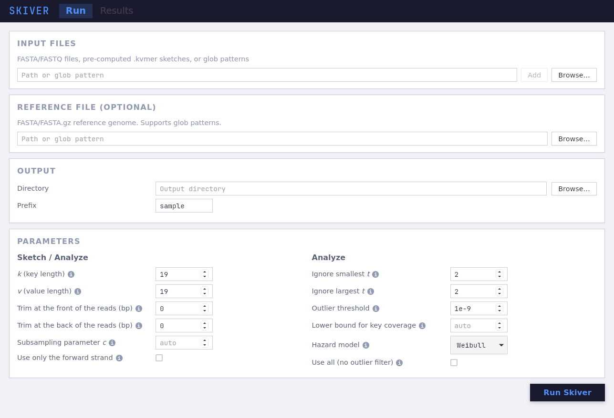
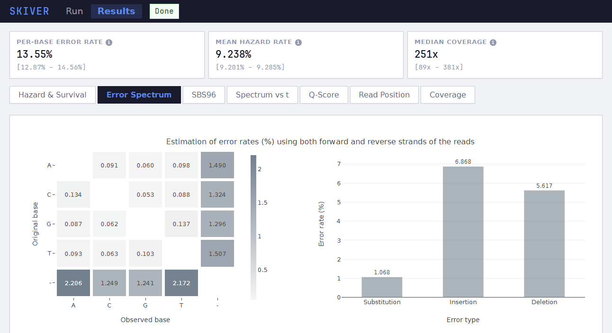
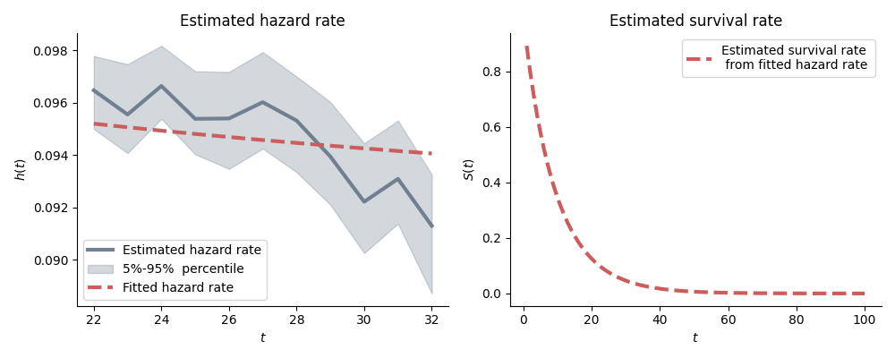
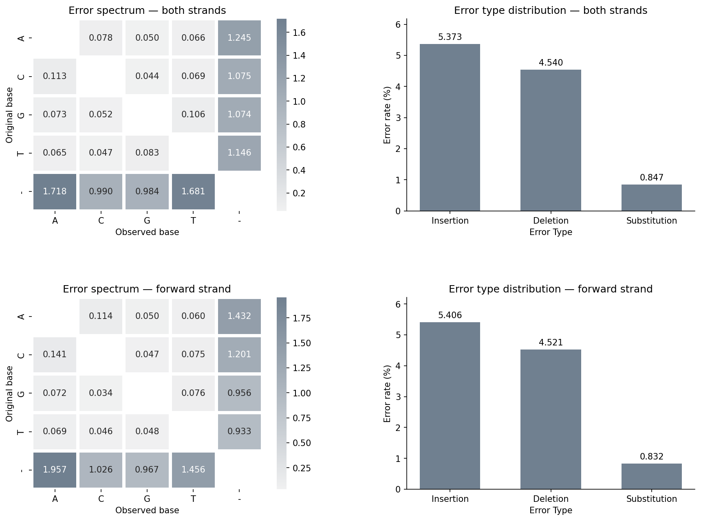
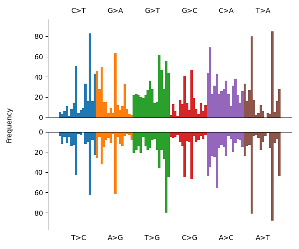
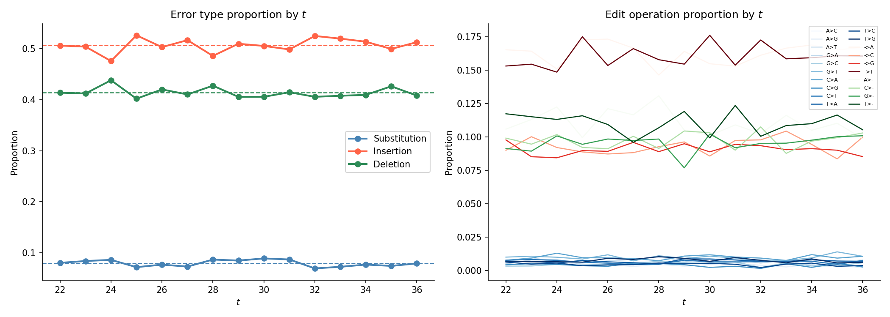
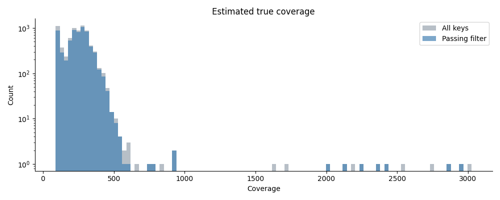
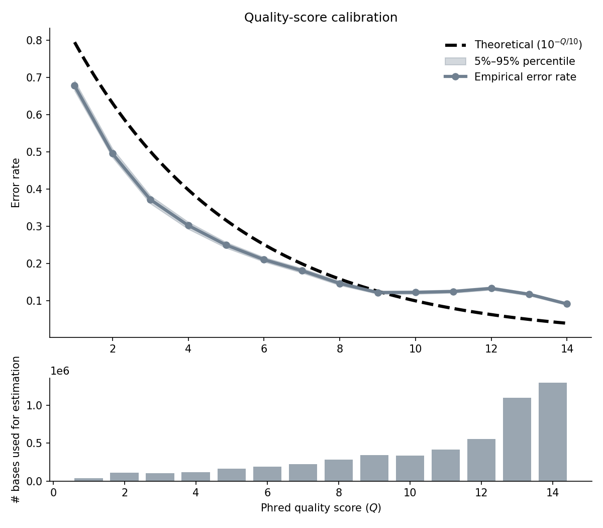
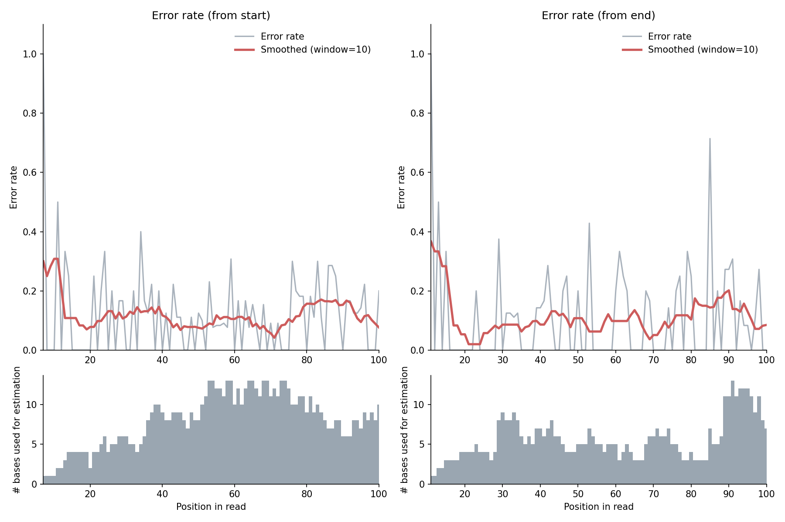
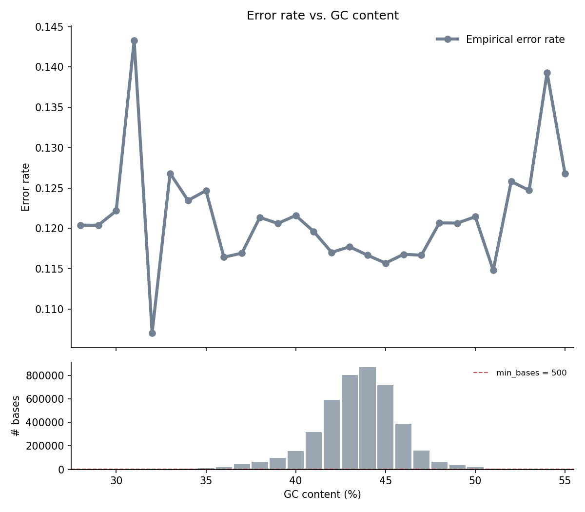

<p align="center">
  
</p>

# Skiver: Reference-free quality control of (meta)genomic sequencing datasets using (*k*, *v*)-mer sketches

Skiver is a tool that aims to perform quality control for a set of reads, estimating the sequencing error rates/types, without relying on the quality scores or the need for a reference genome. It works the best for metagenomic samples where at least one genome has high coverage (>20 $\times$).

## Installation

We provide several ways of installing skiver CLI.

### Conda install

  

```bash
conda install -c bioconda skiver
```

### Download executable

Simply download the executable from the latest release, via the following

```bash
wget https://github.com/GZHoffie/skiver/releases/latest/download/skiver
chmod +x ./skiver
./skiver
```

### Build from source

Alternatively, build skiver from the source code. Install [rust](https://rust-lang.org/tools/install/), and build using

```bash
git clone https://github.com/GZHoffie/skiver.git
cd skiver

# If default rust install directory is ~/.cargo
cargo install --path . --root ~/.cargo
```

## Quick start

Basic commands:

```bash
# sketch the read files + analyze
skiver sketch [sequence_file_1] [sequence_file_2] ... -o sequences.kvmer
skiver analyze sequences.kvmer -o output_prefix

# Alternatively, analyze the files directly
skiver analyze [sequence_file_1] [sequence_file_2] ... -o output_prefix

# If a reference genome is provided
# Add `--use-all` to disable the iterative outlier filter
skiver analyze [sequence_file_1] [sequence_file_2] ... -r [reference_file] --use-all -o output_prefix
```

The input sequence files can be represented using regex. Gzipped files are also accepted.

FASTA/FASTQ processing uses all available CPUs by default. Use `-t/--threads` to set a fixed worker count, or `-t 1` for the lowest-memory sequential path. See [the performance notes](docs/performance.md) for benchmark results and methodology.

Gzip input uses COMBINE-lab's pure-Rust `rapidgzip-core` parallel decoder by default. To build without it, disable default features (and re-enable `bam` if needed): `cargo build --release --no-default-features` or `cargo build --release --no-default-features --features bam`.

For the full set of available options, use the help function,


```bash
skiver sketch -h
skiver analyze -h
```

## `skiver` App

We provide an all-in-one app for analyzing and visualizing the information in sequencing datasets. Please refer to [this guide](./docs/install_skiver_app.md) for detailed steps to run the app on your system.

<p align="center">
  
  
</p>

Please see the [latest release](https://github.com/GZHoffie/skiver/releases) page for download links. Currently, Windows and Ubuntu are supported.

### Interpreting the results

See [this guide](./docs/result_interpretation.md) for a detailed documentation of what each output file contains.

## Example

We provide scripts in `./scripts` for easy visualization of skiver's output. Below is an example of analysis using [*B. Subtilis* isolate reads from Loman Lab](https://lomanlab.github.io/mockcommunity/).

```bash
# Download the reads with SRA toolkit. If not installed, install with
# `conda install -c bioconda sra-tools`
# This read set takes ~3GB space, ~10 min to download
prefetch SRR7498042
fasterq-dump SRR7498042 # In some versions, need to run `fastq-dump SRR7498042` instead

# Create the (k,v)-mer sketch of the data in the example/ folder
mkdir -p example
skiver sketch SRR7498042.fastq -o example/SRR7498042.kvmer

# Run skiver analyze, with all the verbose output
skiver analyze example/SRR7498042.kvmer -o example/SRR7498042

# visualize the output in the figures/ folder
mkdir -p figures
python scripts/plot_all.py example/SRR7498042 -o figures/SRR7498042
```

This creates the verbose output in [`example/SRR7498042.*.csv`](example/), and visualize the output in [`figures/SRR7498042_*.png`](figures/).

`skiver analyze` also generates six summary figures as vector PDFs using
the Rust [`kuva` package](https://github.com/Psy-Fer/kuva). It writes `example/SRR7498042.plot_*.pdf` files alongside the CSV reports.

Apart from `plot_all.py`, you can also use the individual scripts and adjust the parameters like the following.

- **Visualizing hazard rate and survival rate estimates**

  ```bash
  python scripts/plot_hazard_survival_rate.py example/SRR7498042.hazard_rate.csv example/SRR7498042.summary_error_rate.csv figures/SRR7498042_hazard_survival.png -t 1 -T 100 > survival_rate_estimates.csv
  ```

  This command outputs the plot `hazard_survival_rate.png`, along with the estimated survival rates in `survival_rate_estimates.csv`, with the range of `t` specified using `-t` and `-T`.

  <p align="center">
    
  </p>

- **Visualizing error spectrum**

  ```bash
  python scripts/plot_spectrum.py example/SRR7498042.summary_error_spectrum.csv figures/SRR7498042_spectrum.png --normalize
  ```

  will plot the error spectrum in `figures/spectrum.png`. If `--normalize` is set, the error spectrum is normalized such that the frequencies sum to 1. Otherwise, they sum up to the estimated per-base error rate. The output image looks like this.

  
  <p align="center">
    
  </p>

  On the top subplots, the error rates are calculated by accounting for both the forward and reverse complement of the reads. On the bottom, only the forward strand is included.

- **Visualizing single base substitution (SBS) spectrum**

  ```bash
  python scripts/plot_sbs96_spectrum.py example/SRR7498042.summary_error_spectrum.csv figures/SRR7498042_sbs96_spectrum.png
  ```

  will plot the [SBS96](https://cancer.sanger.ac.uk/signatures/sbs/sbs96/) spectrum.

  <p align="center">
    
  </p>

- **Visualizing single base substitution (SBS) spectrum**

  ```bash
  python scripts/plot_error_spectrum_dependence_on_t.py example/SRR7498042.summary_error_spectrum_dependence_on_v.csv figures/SRR7498042_error_spectrum_dep_t.png
  ```

  will plot how the composition of error rate change with *t*. If our assumption is valid, the composition should not vary too much across *t*.

  <p align="center">
    
  </p>

- **Visualizing coverage**

  ```bash
  python scripts/plot_coverage.py example/SRR7498042.kvmer.csv example/SRR7498042.summary_error_rate.csv figures/SRR7498042_coverage.png
  ```

  will plot the estimated **true** coverage of the analyzed file. The true coverage is estimated by the multiplicities of the key from the sketched (k,v)-mers, divided by $\hat{S}(k)$.

  <p align="center">
    
  </p> 

- **Quality score calibration**

  ```bash
  python ./scripts/plot_qscore_calibration.py example/SRR7498042.summary_phred.csv figures/SRR7498042_qscore_calibration.png
  ```

  will plot the theoretical and empirical error rates of the Phred scores in log scale (if included the `--log` option), along with a histogram of the Phred scores.

   <p align="center">
    
  </p> 

- **Dependence of error rate on position in the read**

  ```bash
  python ./scripts/plot_read_position.py example/SRR7498042.summary_read_position.csv figures/SRR7498042_read_position.png
  ```

  will plot the estimated error rate at the positions close to the two ends of the read, which can help to decide how many bases to trim at each end.

   <p align="center">
    
  </p> 

- **Dependence of error rate on GC-content of the read**

  ```bash
  python ./scripts/plot_gc_content.py example/SRR7498042.summary_gc_content.csv figures/SRR7498042_gc_content.png
  ```

  will plot the empirical error rate observed in sketched (*k*, *v*)-mers with respect to the GC-content of the read where they come from.

   <p align="center">
    
  </p> 
  

## Contribution

This is my first project in rust and this project is in early stages of development. All contributions, suggestions, and feature requests are welcomed!

I document some key design choices as well as known limitations of skiver in [this documentation](./docs/design_choices.md) for future reference and directions for improvements.

## Citation

Gu, Z., Sharma, P., Wong, L., & Nagarajan, N. (2026). [Skiver: Reference-free quality control of metagenomic sequencing datasets using (*k*, *v*)-mer Sketches](https://www.biorxiv.org/content/10.64898/2026.02.12.705514v2). *bioRxiv*, 2026-06.
